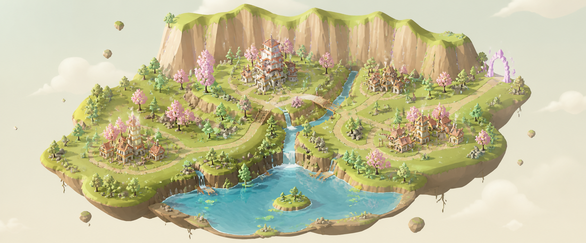

<div align="center">

# Repo Magical Kingdom

**Turn a public GitHub repository into a living, explorable 3D world.**



<p align="center">
  <a href="https://github.com/parrisdigital/repo-magical-kingdom/actions/workflows/ci.yml">
    <picture>
      <source media="(prefers-color-scheme: dark)" srcset="https://shieldcn.dev/github/ci/parrisdigital/repo-magical-kingdom.svg?workflow=ci.yml&amp;branch=main&amp;variant=ghost&amp;size=xs&amp;theme=emerald&amp;font=geist&amp;statusDot=true&amp;animate=pulse&amp;mode=dark" />
      
    </picture>
  </a>
  <a href="https://github.com/parrisdigital/repo-magical-kingdom/stargazers">
    <picture>
      <source media="(prefers-color-scheme: dark)" srcset="https://shieldcn.dev/github/parrisdigital/repo-magical-kingdom/stars.svg?variant=ghost&amp;size=xs&amp;theme=slate&amp;font=geist&amp;mode=dark" />
      
    </picture>
  </a>
  <a href="https://github.com/parrisdigital/repo-magical-kingdom/blob/main/LICENSE">
    <picture>
      <source media="(prefers-color-scheme: dark)" srcset="https://shieldcn.dev/github/parrisdigital/repo-magical-kingdom/license.svg?variant=ghost&amp;size=xs&amp;theme=slate&amp;font=geist&amp;mode=dark" />
      
    </picture>
  </a>
  <a href="https://github.com/parrisdigital/repo-magical-kingdom/graphs/contributors">
    <picture>
      <source media="(prefers-color-scheme: dark)" srcset="https://shieldcn.dev/github/parrisdigital/repo-magical-kingdom/contributors.svg?variant=ghost&amp;size=xs&amp;theme=slate&amp;font=geist&amp;mode=dark" />
      
    </picture>
  </a>
  <a href="https://github.com/parrisdigital/repo-magical-kingdom/commits/main">
    <picture>
      <source media="(prefers-color-scheme: dark)" srcset="https://shieldcn.dev/github/parrisdigital/repo-magical-kingdom/last-commit.svg?variant=ghost&amp;size=xs&amp;theme=slate&amp;font=geist&amp;mode=dark" />
      
    </picture>
  </a>
</p>

[Architecture](docs/ARCHITECTURE.md) ·
[Contributing](CONTRIBUTING.md) ·
[Seasonal assets](docs/SEASONAL_ASSET_PLAYBOOK.md) ·
[Credits](docs/CREDITS.md) ·
[Security](SECURITY.md)

</div>

Repo Magical Kingdom turns repository structure into geography you can orbit,
zoom through, inspect, and eventually cross between. Each repository receives a
deterministic realm identity—a Source Forge, Warden Reach, Archive Domain,
Observatory Frontier, Garden Realm, or Crossroads—while every
repository-derived landmark remains traceable to an exact source revision.

> [!NOTE]
> The first open-source release is under active development. Interfaces and
> world-package contracts may change before 1.0; tagged releases will document
> compatibility guarantees.

## From source tree to living world

```text
GitHub URL
  → public-repository verification
  → immutable commit snapshot
  → repository semantics and coverage
  → deterministic realm WorldPackage
  → React Three Fiber kingdom
```

The world hierarchy is deliberately legible:

| Repository concept                     | Kingdom expression               |
| -------------------------------------- | -------------------------------- |
| GitHub profile or organization         | Universe                         |
| Repository                             | Kingdom or world                 |
| Repository root                        | Crown Nexus                      |
| Workspace, package, or major subsystem | Province                         |
| Module or folder cluster               | Settlement                       |
| File or symbol                         | Landmark or aggregated structure |
| Verified internal relationship         | Road, bridge, or route           |
| External dependency                    | Outbound gateway                 |
| Indexed repository relationship        | Enterable portal                 |

Decorative trees, animals, particles, weather, and water do not secretly claim
to be files or quality scores. When scenery communicates repository data, the
experience says so and links back to its evidence.

## Design principles

- **A world, not a reskinned city.** Repository evidence becomes terrain,
  settlements, archives, workshops, strongholds, paths, and portals through a
  coherent world archetype. Spring, summer, autumn, and winter are selectable
  appearances over the same repository-derived geography.
- **Truth before spectacle.** Meaningful objects expose their repository path,
  immutable commit, and reason for existing.
- **Stable geography.** A seed and versioned compiler keep repeated builds
  deterministic and preserve locality across nearby revisions.
- **Complete coverage.** A file is represented directly, included in a named
  aggregate, or explicitly omitted with a reason.
- **Progressive scale.** Universe summaries remain light; full kingdoms load
  only when visited and use hierarchy, instancing, and LOD.
- **Open assets, deterministic composition.** Audited CC0 models and original
  runtime systems form each world without a paid asset, proprietary runtime, or
  GPU generation service.
- **Accessible outside the canvas.** Controls, source details, errors, credits,
  and fallback navigation remain available through semantic HTML.

## Local development

Requirements:

- Node.js 22.17 or newer
- pnpm 10.32.1
- A WebGL 2-capable browser for the complete 3D scene

```bash
git clone https://github.com/parrisdigital/repo-magical-kingdom.git
cd repo-magical-kingdom
corepack enable
pnpm install --frozen-lockfile
cp .env.example .env.local
pnpm dev
```

Open <http://localhost:3000>. Public repositories work without a token at a
lower GitHub API quota. A server-only, public-read token can be added to
`.env.local`:

```dotenv
GITHUB_TOKEN=
NEXT_PUBLIC_SITE_URL=http://localhost:3000
```

Never expose a GitHub token through a `NEXT_PUBLIC_` environment variable.

## Quality gates

```bash
pnpm validate
pnpm test:e2e
pnpm assets:verify
node attribution/validate.mjs
```

The GitHub workflows run formatting, linting, type checks, unit tests,
production builds, Chromium journeys, CodeQL, dependency review, and attribution
validation. Third-party Actions are pinned to immutable commit SHAs.

## Architecture

The compiler and renderer have intentionally different responsibilities:

- The GitHub boundary handles canonical input, immutable revision resolution,
  public visibility, tree recovery, validation, rate limits, and provenance.
- Pure domain code classifies and aggregates repository evidence into a
  versioned kingdom graph.
- The realm compiler assigns a stable world archetype, regions, terrain,
  landmarks, routes, camera anchors, LOD groups, and coverage metadata.
- The serialized `WorldPackage` contains no React, DOM, Three.js, or provider
  response objects.
- React Three Fiber renders the package and owns camera, picking, quality, and
  ambient living systems.

Read the complete [architecture specification](docs/ARCHITECTURE.md) and
[source-lineage policy](docs/SOURCE_LINEAGE.md). The
[seasonal asset playbook](docs/SEASONAL_ASSET_PLAYBOOK.md) documents the legal
sourcing, generation, and topology-preserving appearance workflow.

## Open-source trust model

The hosted service begins with public GitHub repositories only. Submitted source
is treated as untrusted data and is never executed. A repository must be
verified public before its tree can enter a shared cache, and shared kingdom
links resolve to an immutable commit SHA.

Project assets follow a provenance-first policy. Unknown, noncommercial,
no-derivatives, or redistribution-prohibited media is rejected by default. CI
checks direct runtime dependency coverage and rejects unregistered distributed
assets. See [the asset policy](docs/ASSET_POLICY.md) and the
[machine-readable registry](attribution/registry.json).

## Recognition and provenance

Repo Magical Kingdom is an independent open-source project built with and
informed by remarkable work:

- **[Repository City](https://github.com/parrisdigital/repository-city)** is the
  MIT-licensed product and architectural predecessor that established the
  original repository-to-place concept.
- **[ShieldCN](https://shieldcn.dev/)** renders the README's live, theme-aware
  repository badges. The animated CI badge uses pure SVG animation with a
  reduced-motion fallback; ShieldCN is not an application runtime dependency.
- **[WorldClaw](https://arxiv.org/abs/2608.05248)** informed the structured,
  coarse-to-fine world-planning direction as published research. Its reviewed
  repository revision did not declare a software license, so no WorldClaw code,
  figures, imagery, meshes, website assets, or generated results are copied or
  redistributed.
- **[Quaternius](https://quaternius.com/)** created the CC0 textured medieval
  architecture, stylized nature, and animated wildlife models that form the
  world's authored visual foundation. The shipped subset is optimized for the
  browser, fully registered, and distributed with its source license texts.
- **[Kenney](https://kenney.nl/)** created the CC0 Nature and Holiday kits used
  for paired green/autumn trees, snowy silhouettes, and seasonal ground
  treatments. The tiny curated subset is independently licensed, reproducible,
  and does not contain WorldClaw media.
- **[Three.js](https://threejs.org/),
  [React Three Fiber](https://r3f.docs.pmnd.rs/), and
  [Drei](https://github.com/pmndrs/drei)** form the open-source browser 3D
  foundation.

See [ACKNOWLEDGEMENTS.md](ACKNOWLEDGEMENTS.md),
[THIRD_PARTY_NOTICES.md](THIRD_PARTY_NOTICES.md), and
[docs/CREDITS.md](docs/CREDITS.md) for exact revisions and relationships.

## Contributors

<p align="center">
  <a href="https://github.com/parrisdigital/repo-magical-kingdom/graphs/contributors">
    <picture>
      <source media="(prefers-color-scheme: dark)" srcset="https://shieldcn.dev/contributors/parrisdigital/repo-magical-kingdom.svg?title=false&amp;preset=transparent&amp;border=false&amp;mode=dark" />
      
    </picture>
  </a>
</p>

Contributions are welcome. Start with [CONTRIBUTING.md](CONTRIBUTING.md), sign
off commits under the [Developer Certificate of Origin](DCO), and review the
[Code of Conduct](CODE_OF_CONDUCT.md).

## License

Repo Magical Kingdom is available under the [MIT License](LICENSE). Third-party
software, research, services, and future assets retain their own copyrights and
licenses.

<div align="center">

Live README signals rendered by [ShieldCN](https://shieldcn.dev/).

</div>
