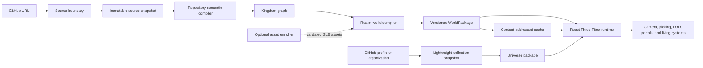

# Architecture

Repo Magical Kingdom converts public GitHub repositories into deterministic,
traceable, explorable 3D worlds. The compiler establishes repository meaning;
the React Three Fiber runtime presents that meaning without owning it.

This document defines the intended stable boundaries. Individual modules may
continue to evolve while the project is pre-1.0.

## Architectural goals

- A shared kingdom URL identifies an immutable repository commit.
- The same build identity produces the same world topology and entity IDs.
- Every meaningful visual object links to source evidence.
- Every eligible source file is direct, aggregated, or explicitly omitted.
- Ambient magic remains distinguishable from repository-derived meaning.
- Large repositories degrade through hierarchy and LOD, not silent data loss.
- The core compiler remains testable without WebGL, React, or network access.
- Optional generative enrichment can fail without preventing world entry.

## System flow



## Product hierarchy

| Source concept                         | World concept                    |
| -------------------------------------- | -------------------------------- |
| GitHub profile or organization         | Universe                         |
| Repository                             | Kingdom or world                 |
| Repository root                        | Crown Nexus                      |
| Workspace, package, or major subsystem | Province                         |
| Module or folder cluster               | Settlement                       |
| File or symbol                         | Landmark or aggregated structure |
| Verified internal relationship         | Road, bridge, or route           |
| External dependency                    | Outbound gateway                 |
| Indexed repository relationship        | Enterable portal                 |

The visual vocabulary is a public contract. A road cannot claim to represent an
import unless the compiler has verified that import. Trees, weather, wildlife,
water, and ambient particles are decorative unless a visible analytical lens
states otherwise.

## Source boundary

The initial provider supports public GitHub repositories only.

Responsibilities:

1. Parse and canonicalize an allowlisted GitHub input.
2. Fetch repository metadata using server-only credentials.
3. Assert that the repository is public before shared caching.
4. Resolve a branch or tag to an immutable commit SHA.
5. Fetch the Git tree and recover truncated trees by walking subtrees.
6. Validate external responses and return typed failures.
7. Preserve data coverage and provenance in the source snapshot.

Repository content is untrusted data. The service does not execute source code,
render repository HTML, or expose credentials to the browser. Targeted semantic
analysis may parse bounded text files, but it must use safe parsers and explicit
size and file-type limits.

## Domain contracts

### Source identity

The source identity records the provider, owner, repository ID, repository
name, default branch, immutable commit SHA, public visibility, canonical URL,
license signal, and exact revision URL.

### Kingdom world

The initial `repo-kingdom/v1` contract contains:

- Build identity and compiler version
- Source identity and provenance
- One user-selected world season (`spring`, `summer`, `autumn`, or `winter`)
- File-derived or aggregate entities
- Root routes and repository portals
- Bounds and camera-relevant spatial information
- Complete coverage statistics
- Repository statistics and structured warnings

The package is serializable data. It must not contain React elements, DOM
objects, Three.js instances, GPU resources, provider response objects, or
secrets.

### Repository universe

The `repo-universe/v1` contract contains lightweight repository summaries and
stable overview placement for a profile or organization. Every summary also
has a deterministic seasonal identity used to render a small spherical world
with terrain, a road, vegetation, and a settlement silhouette. It deliberately
does not contain every repository tree. Full miniature detail is rendered only
for a bounded nearest or selected set, and a kingdom is fetched or compiled
only when the visitor enters it.

## Determinism and compatibility

The conceptual build key combines:

```text
provider + repository ID + commit SHA + compiler version
+ style version + seed + quality tier
```

Rules:

- Stable IDs derive from canonical source identity, not input array order.
- Wall-clock timestamps do not participate in the content digest.
- Sorting is explicit before hashing, grouping, or spatial assignment.
- Random variation comes from seeded generators scoped by stable entity ID.
- A compiler change that alters output updates its compiler or style version.
- Schema changes remain explicit and are validated at serialization boundaries.
- Unchanged modules should retain their province and approximate location across
  nearby revisions.

## Realm style

Each repository is one coherent world in one explicitly selected season. The
same immutable repository revision can be forged as spring, summer, autumn, or
winter; the season changes presentation and build identity without changing
the repository-derived semantic geography.

- The repository root becomes the Crown Nexus at the world's navigational
  heart.
- Major source provinces become settlements or regions within the same
  selected season; the compiler does not auto-assign mixed province biomes.
- Shared semantic masks drive terrain, material blending, vegetation, weather,
  placement, and navigation.
- Repository categories become world-native archetypes—such as villages,
  archives, watch keeps, observatories, workshops, and ruins—rather than a
  generic building extrusion.
- Activity and analysis lenses may animate or recolor geography but do not
  silently redefine canonical placement.

## Runtime

React Three Fiber is the initial and only renderer. Keeping `WorldPackage`
renderer-neutral allows headless inspection and future renderers without adding
speculative adapter layers now.

Runtime responsibilities:

- Decode and validate a world package.
- Select a quality tier from explicit user preference and device capability.
- Render repeated structures and scenery through instancing.
- Chunk instances geographically for useful frustum and distance culling.
- Stream higher-detail provinces and portal destinations on demand.
- Expose DOM-based labels, controls, details, errors, and accessible fallback.
- Keep high-frequency animation outside React state updates.

## Camera and navigation

Camera state belongs to a world-scoped state machine:

```text
universe → kingdom-overview → province-focus → landmark-focus
                                         ↘ optional walk mode
```

Each world has explicit overview and focus anchors. Reset always targets the
active world, not historical controls state. The first release prioritizes
perspective orbit, pan, wheel/pinch zoom, bounded fly-to transitions, a minimap,
and breadcrumbs. Walk mode requires collision, navigation, mobile controls, and
interaction-distance validation before it can ship.

## Living systems

Life is layered so atmosphere never masquerades as repository evidence.

### Ambient

Wind, water, clouds, seasonal particles, wildlife paths, smoke, lights, and
sound are renderer systems. They are decorative, quality-scaled, and compatible
with reduced-motion and mute preferences.

### Repository-driven

Commits, releases, checks, and pull requests may later drive timestamped visual
signals. Those signals decorate stable geography and always expose their data
source and observation time.

### Interactive

Portals, guided tours, agents, and multiplayer presence are later capabilities.
They must remain optional additions to a kingdom package that can still be
explored without them.

## Coverage and scale

Every discovered file falls into one state:

1. Represented directly
2. Represented inside a named aggregate
3. Omitted under a declared rule with file and byte counts
4. Unavailable because the upstream snapshot is incomplete

The compiler never reports aggregate totals for data it silently discarded.
Large worlds use hierarchy: universe summaries, kingdom provinces, settlement
clusters, and close-range landmarks. Repeated geometry is instanced and direct
interactive entities are budgeted by quality tier.

The world planner scales repository richness logarithmically. A large fixture
may grow to four hamlets, twenty-four aggregated buildings, 240 canopy
instances, twelve wildlife actors, 360 surface details, 150 draw calls, and
750,000 visible triangles, but never one mesh per file. Semantic hit zones keep
all eligible entities traceable even when most files share visual aggregates.
The universe applies the same rule: every returned repository stays selectable,
while only a bounded six low-quality or twelve high-quality planets receive the
full miniature asset layer at once.

Initial performance targets are engineering gates, not marketing promises:

- 60 frames per second on the reference desktop fixture
- At least 30 frames per second on the reference mobile fixture
- Approximately 150 or fewer initial desktop draw calls
- Approximately 100 or fewer initial mobile draw calls
- No unbounded React updates in the render loop

Each target must name the fixture, device, browser, viewport, and quality tier.

## Errors and partial success

Errors are typed by phase: invalid input, authentication, forbidden/private,
not found, rate limited, upstream timeout, invalid upstream data, incomplete
snapshot, compiler budget, world validation, WebGL initialization, and aborted
request.

Partial success is allowed only when coverage and warnings remain visible. A
beautiful scene is not considered correct if it hides missing source data.

## Caching and deployment

The web application is designed for Vercel. Immutable snapshots and packages
can use public, content-addressed caching only after visibility is verified.
Mutable `latest` routes resolve to a commit-specific route rather than changing
the meaning of an existing shared URL.

The checked-in, audited CC0 GLB bundle is the default authored-art layer and is
loaded independently from repository ingestion. Optional future asset
generation belongs in an asynchronous worker behind a stable enrichment
boundary. The web request path never invokes a model, Blender process, or asset
conversion pipeline; deterministic world composition continues when optional
enrichment is unavailable.

## Verification layers

- Pure compiler unit and property tests
- Golden fixtures for repository edge cases
- Provider contract tests with mocked upstream responses
- Package schema and provenance validation
- Renderer interaction and camera-state browser tests
- Desktop and mobile visual regression
- Accessibility and reduced-motion checks
- Performance budgets for draw calls, frame time, memory, and asset bytes
- Live public-repository smoke tests after deployment

See [CONTRIBUTING.md](../CONTRIBUTING.md) and
[RELEASING.md](../RELEASING.md) for the executable quality gates.
